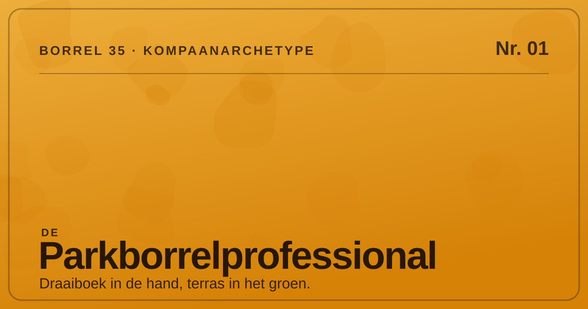
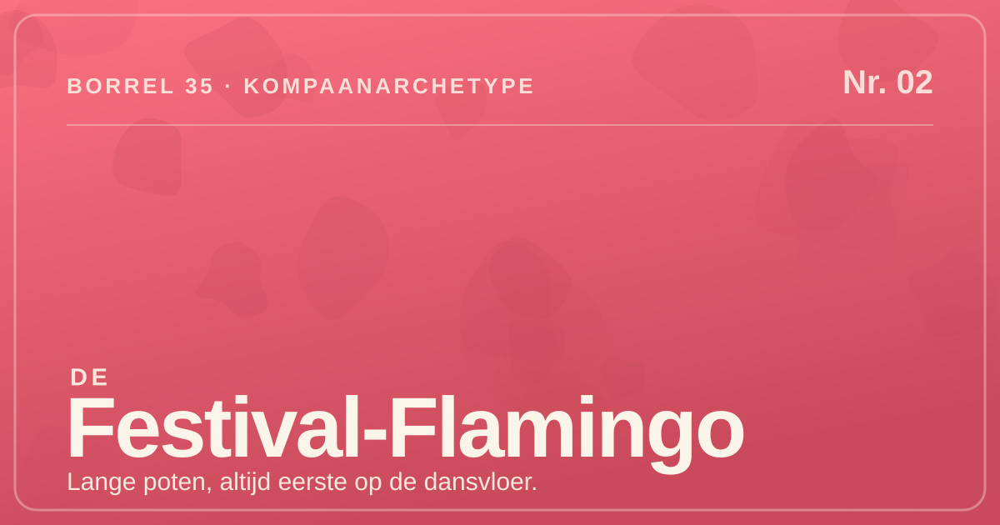
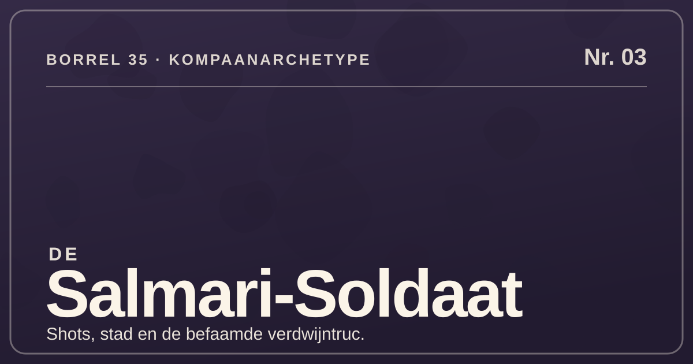
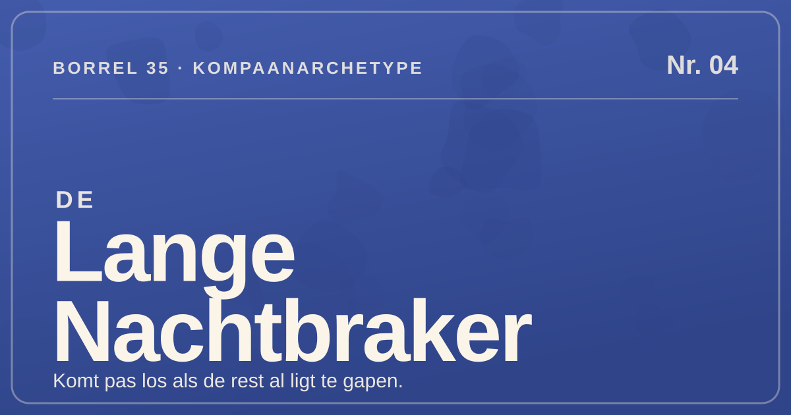
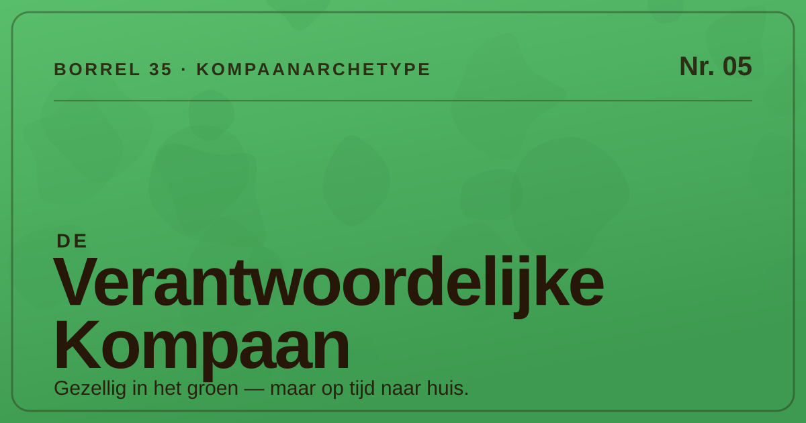
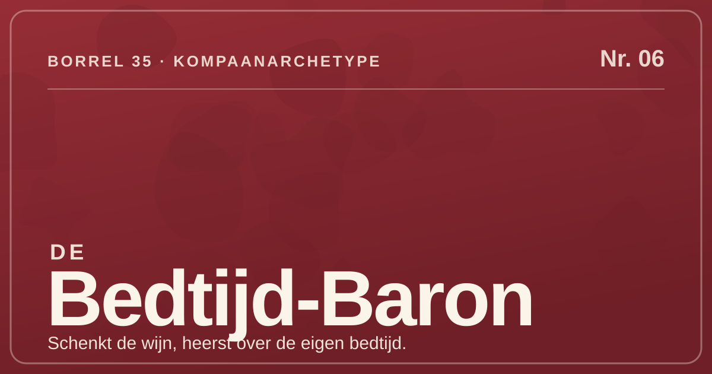

# Kompaan archetypes — Borrel 35

> The final, named archetypes for the Borrel 35 site. Each one is a human reading
> of a cluster produced by the build-time clustering prototype (**BORREL-2.5**,
> `scripts/archetypes/cluster.ts`). The typed source of truth is
> `content/archetypes/index.ts`; this document is the human-readable companion.
>
> **Imagery (BORREL-2.7):** each archetype now ships an on-brand promo/social
> banner (1200×630 SVG) under `public/archetypes/`, referenced below and typed on
> `Archetype.image` in `content/archetypes/index.ts`. These are **code-generated
> placeholder** banners (deterministic vector art in the giraffe/borrel palette),
> meant to be swapped for real AI raster art later — see
> [Image regeneration](#image-regeneration) for a per-archetype prompt.

## Read this first — built on mock data, count pinned

The clustering that produced these archetypes currently runs on the **mock** CSV
(`data/responses.csv`, 40 seeded rows). Those rows are drawn from a **uniform
random pick per question**, so they carry no latent structure: at every cluster
count the clusters are **barely separated** (silhouette ≈ **0.03**, essentially
noise). Because silhouette can't meaningfully choose, the cluster count is
**pinned at `k = 6`** by design (`DEFAULT_K` in `cluster.ts`; override with
`ARCHETYPE_K`), not selected by the data. See `docs/archetype-approach.md` →
*Retuning on real data*.

So treat everything below as a **template**, not a finding. The giraffe voice and
the shape of each profile are the deliverable; the specific dominant answers (the
percentages) — and possibly the right number of archetypes — **must be
re-derived** once the real Google-Form responses land. Rerun `bun run archetypes`,
then update the traits and, if needed, the names in
`content/archetypes/index.ts` and this file.

Because the clusters are noise, some mix contradictory answers; each name leans
on that cluster's **most coherent, defining signals** and ignores the rest. Each
archetype maps 1:1 to a cluster in `scripts/archetypes/archetypes.json` (`k = 6`).
The percentages cited under *Defining traits* are the share of that cluster's
members giving the dominant answer to the question.

---

## De Parkborrelprofessional

_Cluster 0 · 7 respondents_

Regelt de borrel alsof het een gala is: locatie in het groen, terras geclaimd,
draaiboek in de hand. Torent kalm boven de chaos uit en overziet alles vanaf de
zijlijn — spontaan is voor andere dieren.

**Defining traits**

- Natuurmens in hart en nieren (**100%** Natuur boven Stad).
- Plant álles (**71%**) en is dé organisator van het gezelschap (**57%**).
- Terraskoning (**71%**) met een zwak voor een gala (**42%**).
- Danst vanaf de zijlijn (**57%**) en gaat verantwoord naar huis (**57%**).

---

## De Festival-Flamingo

_Cluster 1 · 6 respondents_

Lange poten, fel aanwezig, en op elk festival als eerste op de dansvloer. Roept
dat-ie eraan komt, duikt spontaan op bij elke themaborrel en sluit de avond af
met een hap eten.

**Defining traits**

- Festivalbeest (**100%** Festival) en staat altijd op de dansvloer (**83%**).
- Spontaan (**66%**) en gek op een themaborrel (**66%**).
- Het "ik-kom-eraan"-liegbeest in de groepsapp (**50%**).
- Sluit de avond af met eten (**66%**).

---

## De Salmari-Soldaat

_Cluster 2 · 4 respondents_

Marcheert de stad in, recht de dansvloer op, en gaat door op shots en "nog even
één drankje". Meester van de verdwijntruc: het ene moment middenin het feest, het
volgende spoorloos.

**Defining traits**

- Altijd op de dansvloer (**100%**) en echt een stadsmens (**100%**).
- Meester van de verdwijntruc (**75%**) en door en door spontaan (**75%**).
- Shots (**50%**) en het klassieke "nog even één drankje" (**50%**).
- Kiest terras boven festival als het even kan (**100%**).

---

## De Lange Nachtbraker

_Cluster 3 · 9 respondents_

Avondmens tot in de tenen: begint pas los te komen als de rest al gaapt, en
houdt het bij "nog even één drankje" tot diep in de nacht. Plant zijn avonden
strak, maar danst het liefst vanaf de zijlijn.

**Defining traits**

- Onverbeterlijke avondmens (**88%**).
- Blijft hangen voor "nog even één drankje" (**77%**).
- Plant zijn avond strak (**77%**) en danst vanaf de zijlijn (**77%**).
- Festivalganger als het uitkomt (**66%**).

---

## De Verantwoordelijke Kompaan

_Cluster 4 · 6 respondents_

De trouwe kompaan van de vaste kliek: komt voor de gezelligheid, gaat op tijd
verantwoord naar huis en ligt vroeg op één oor. Een feestborrel in het groen,
maar wel met een oogje op de klok.

**Defining traits**

- Vroeg naar bed (**83%**) en gaat verantwoord naar huis (**66%**).
- Trouw aan de vaste kliek (**50%**).
- Natuurmens (**83%**) met een voorliefde voor de feestborrel (**66%**).
- De stille ghost in de groepsapp (**66%**).

---

## De Bedtijd-Baron

_Cluster 5 · 8 respondents_

Brengt de sfeer, schenkt de wijn en maakt de kroegborrel — maar heerst met
ijzeren hand over de eigen bedtijd. Om twaalf uur verandert deze pompoen resoluut
in een uitgeruste ochtendmens.

**Defining traits**

- Onwrikbaar vroeg naar bed (**100%**).
- Ochtendmens (**62%**) die tóch de sfeermaker is (**37%**).
- Houdt van een kroegborrel (**37%**) met een glas wijn (**37%**).
- Danst het liefst vanaf de zijlijn (**62%**).

---

## Image regeneration

The banners under `public/archetypes/` are **code-generated placeholders**:
deterministic 1200×630 SVGs built from the giraffe/borrel design tokens
(`app/theme/tokens.css`) by a small script, one per archetype `id`. They exist so
the site has on-brand promo/social art today; a code agent can't call an AI image
model, so real raster art is a later, optional swap.

> The image links under each archetype above use a **repo-relative** path
> (`../public/archetypes/<id>.svg`) so they render in GitHub / Markdown viewers.
> The **served** URL at runtime is `/archetypes/<id>.svg` — that is the value on
> `Archetype.image` in `content/archetypes/index.ts`.

**To regenerate the placeholder SVGs** (e.g. after retuning names/taglines): edit
the archetype table in the generator and re-run it, writing to
`public/archetypes/<id>.svg` (filename must equal each archetype's `id` so
`Archetype.image` keeps resolving).

**To swap in real AI raster art:** generate a `1200×630` image per archetype with
an AI image tool using the prompt below, export it (PNG/WebP), drop it in
`public/archetypes/`, and point that archetype's `image` field in
`content/archetypes/index.ts` at the new file. Keep a colour that matches the
archetype's mapped hue so the cards and charts stay coherent.

Shared style for every prompt: _"Playful, bold, vertical editorial poster for a
Dutch borrel (drinks) survey site called Borrel 35. Flat vector / risograph feel,
warm savanna cream background, giraffe-patch spot motif, oversized condensed
display type, lots of vertical breathing room. 1200×630 social banner."_ Then per
archetype:

- **De Parkborrelprofessional** — hue **giraffe gold** (`--brand-giraffe`,
  `#edae3b`). A calm, organised giraffe overseeing a leafy park borrel from the
  terrace: clipboard/draaiboek in hand, claimed terrace table, nature-over-city,
  plans everything, dances from the sidelines, heads home responsibly.
- **De Festival-Flamingo** — hue **festival coral** (`--brand-flamingo`,
  `#fc7182`). A long-legged flamingo front-and-centre on a festival dance floor,
  spontaneous and loud, first to dance, loves a themed borrel, ends the night with
  a bite to eat.
- **De Salmari-Soldaat** — hue **salmiak liquorice** (`--brand-liquorice`,
  `#342a46`). A night-city marcher powered by salmiak shots and "just one more
  drink", always on the dance floor, master of the disappearing trick — here one
  moment, gone the next.
- **De Lange Nachtbraker** — hue **night indigo** (`--brand-night`, `#445dad`). A
  tall night-owl who only comes alive when everyone else is yawning, nurses "one
  more drink" deep into the night, plans the evening tightly but dances from the
  sidelines.
- **De Verantwoordelijke Kompaan** — hue **park green** (`--brand-park`,
  `#59be6c`). The loyal companion of the regular crew at a party borrel in the
  green: there for the cosiness, one eye on the clock, home on time and early to
  bed.
- **De Bedtijd-Baron** — hue **kroeg claret** (`--brand-wine`, `#962d36`). A warm
  pub-borrel host pouring wine and setting the mood, but ruling his own bedtime
  with an iron fist — at midnight he turns resolutely into a well-rested morning
  person.
